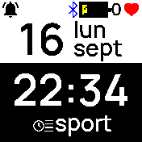
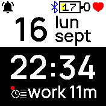

# Clock info Time tracker

A time tracker with task switched from clock info.

Active task avec a red dot in icon and display elapsed time.

## Usage

Simply choose task in your clock info by swipe up or down and validate by a tap.

## Controls

Swipe up or down to change task.
Validate by a tap.

## Todo

- Add interface for viewing data and define task list.
- Rotate task log.

## Requests

contact [europrimus on git hub](https://github.com/europrimus/)

## Creator

[Didier COURTY](https://didier.courty.fr)
